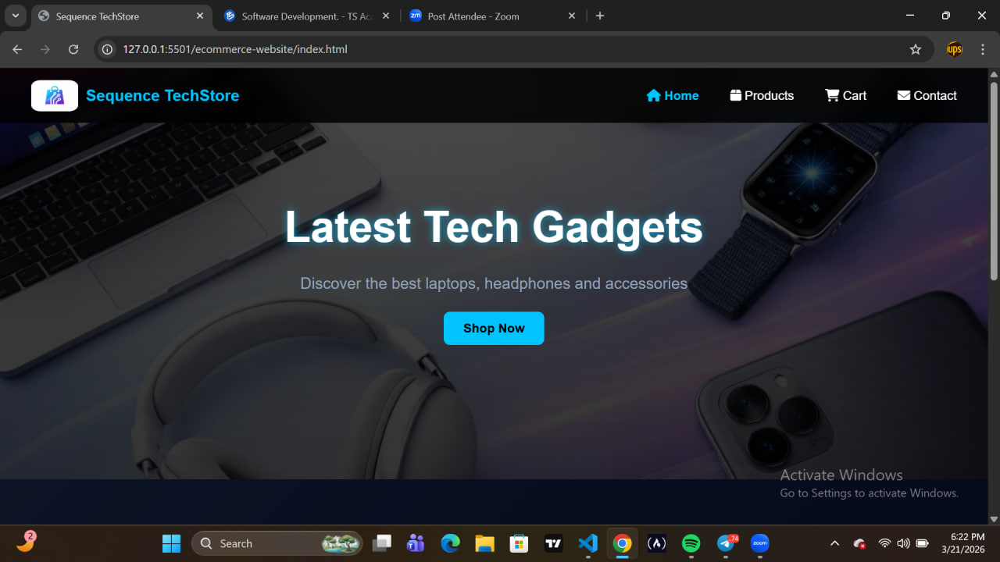

# 🛒 Sequence TechStore – E-Commerce Website

A modern and responsive multi-page e-commerce website built using HTML, CSS, and basic JavaScript.  

This project was created as part of my web development internship practice to simulate a real-world online store experience.

---

## 🚀 Project Overview

Sequence TechStore is a tech-focused online store that allows users to:

- Browse a variety of tech products
- View detailed product information
- Navigate across multiple pages
- Experience smooth animations and modern UI interactions

The project focuses on clean design, structure, and responsiveness.

---

## ✨ Features

- ✅ Multi-page website (Home, Products, Product Details, Cart, Contact)
- ✅ Responsive layout using Flexbox
- ✅ Sticky navigation bar with icons
- ✅ Hero section with background image and overlay
- ✅ Product cards with hover effects
- ✅ Scroll-triggered animations
- ✅ Product detail navigation using anchor links
- ✅ Cart page UI layout
- ✅ Contact form with social media links
- ✅ Consistent UI/UX design across all pages

---

## 🛠️ Built With

- HTML5
- CSS3
- Flexbox
- JavaScript (for scroll animations)
- Font Awesome Icons

---

## 📂 Project Structure

ecommerce-website/
│
├── index.html
├── products.html
├── product.html
├── cart.html
├── contact.html
│
├── css/
│   └── styles.css
│
├── js/
│   └── script.js
│
└── assets/
├── images/
└── icons/

---

## 🎯 Purpose

This project was built to:

- Internship project
- Practice building real-world web layouts
- Understand multi-page navigation
- Improve UI/UX design skills
- Strengthen knowledge of HTML and CSS structure
- Prepare for building interactive features with JavaScript

---

## 💡 What I Learned

- Structuring a complete multi-page website
- Creating reusable UI components
- Designing responsive layouts
- Improving visual hierarchy and spacing
- Implementing animations for better user experience

---

## 📸 Preview

**

---

## 🔮 Future Improvements

- Add full cart functionality using JavaScript
- Implement product filtering and search
- Improve accessibility
- Connect to a backend for real data handling

---

## 👨🏽‍💻 Author

Isreal Jumbo (Sequence)  
Aspiring Full-Stack Developer  

- GitHub: https://github.com/Isreal-Jumbo

---

## 📄 License

This project was built for educational and internship purposes.