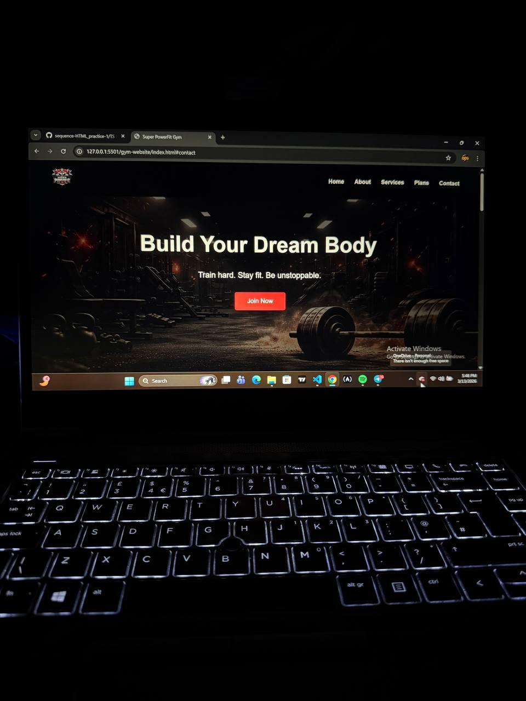
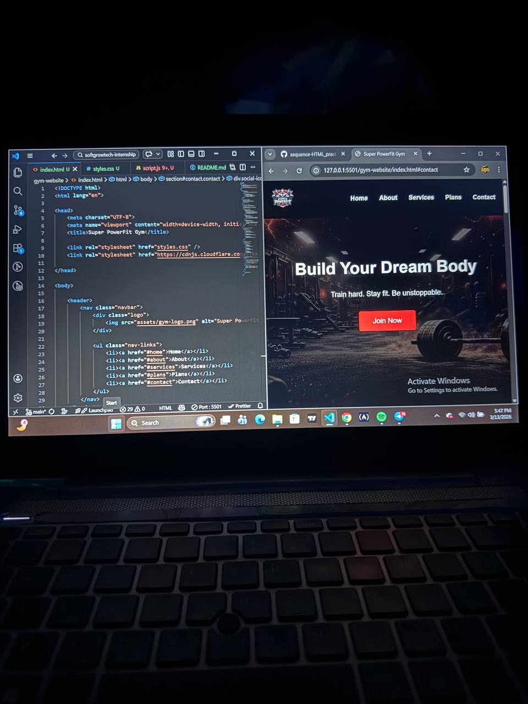

# 🏋️ Super PowerFit Gym Website

A modern Gym Landing Page built using HTML and CSS.  
This project was created as part of my web development internship practice, focusing on building a clean and responsive landing page for a fitness brand.

The website showcases a gym’s services, membership plans, and contact information while presenting a strong and energetic visual identity.

---

## 🚀 Project Overview

The Super PowerFit Gym Website is a single-page landing site designed to promote a fitness brand. The layout includes a strong hero section, service highlights, membership plans, and contact details.

The goal of this project was to practice:

- Structuring real-world landing pages with HTML
- Designing layouts using CSS
- Organizing content into clear sections
- Creating a visually engaging hero section with a background image
- Improving UI layout and spacing

---

## 🧩 Features

- Responsive navigation bar with gym logo
- Hero section with motivational call-to-action
- "Why Super PowerFit" section explaining gym benefits
- Service/program highlights
- Membership pricing plans
- Contact form section
- Social media icons (Facebook, Twitter, Instagram, YouTube)
- Clean modern layout and typography

---

## 🛠 Technologies Used

- HTML5
- CSS3
- Font Awesome Icons

---

## 📂 Project Structure
gym-website
│
├── index.html
├── styles.css
├── script.js
│
└── assets
├── gym-logo.png
└── gym-image.jpg

---

## 🎯 What I Learned

While building this project, I practiced:

- Designing structured landing pages
- Using flexbox layouts
- Working with background images
- Creating reusable UI sections
- Improving visual hierarchy
- Organizing project folders for real-world development

---

## 📸 Preview

---

## 👨‍💻 Author

Isreal Jumbo (Sequence)  
Aspiring Full-Stack Developer  

- GitHub: https://github.com/Isreal-Jumbo

Learning. Building. Improving.