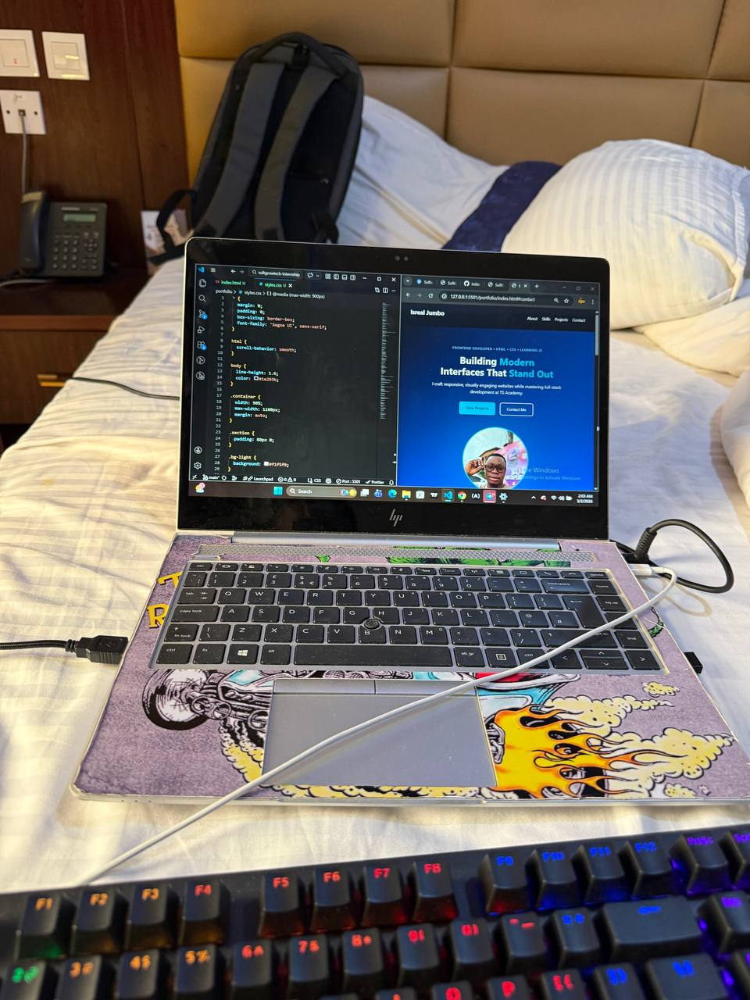
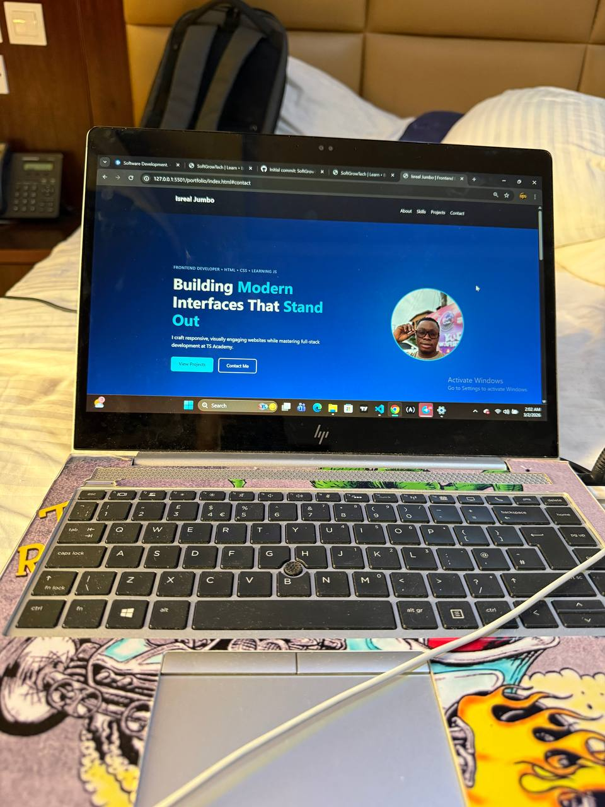

🚀 Live Preview
https://github.com/Sequence-glitch/softgrowtech-internship/tree/main/portfolio

📌 About The Project

This portfolio was built as part of my Web Development Internship task.
The goal was to create a clean, professional, and responsive personal website using only HTML and CSS.

It highlights:
 • Hero section with bold tech styling
 • About section
 • Skills section
 • Projects showcase
 • Contact section
 • Fully responsive layout

⸻

🛠️ Built With
 • HTML5 (Semantic Structure)
 • CSS3 (Flexbox, Grid, Media Queries)
 • Responsive Design Principles

 📂 Folder Structure
 portfolio/
│
├── index.html
├── styles.css
└── assets/
    └── profile.jpg

    ✨ Features
 • Modern gradient hero section
 • Profile image with glow effect
 • Responsive navigation
 • Project cards layout
 • Styled contact section
 • Mobile-friendly design

⸻

📱 Responsive Design

The website adapts smoothly across:
 • Desktop
 • Tablet
 • Mobile devices

Media queries were used to adjust layout and typography for smaller screens.

⸻

📸 Preview

📬 Contact
 • Email: israeljumbo160@gmail.com
 • LinkedIn: linkedin.com/in/isreal-jumbo
 • GitHub: github.com/Sequence-glitch

⸻

📄 License

This project is open-source and available under the MIT License.

⸻

👨🏽‍💻 Author

Isreal Jumbo
Frontend Developer in Training
TS Academy Full-Stack Scholar